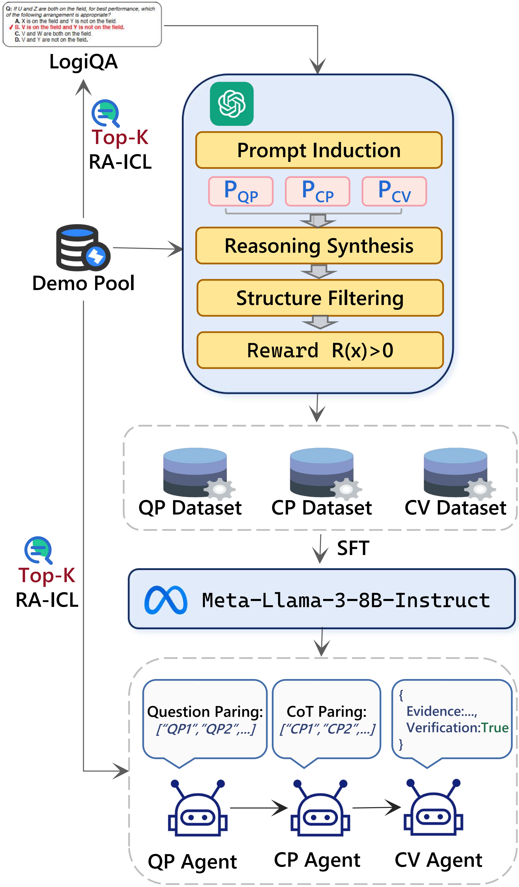

<h1 align="center">LLMSR@XLLM25:🧠 Less is More: Enhancing Structured Multi-Agent Reasoning via Quality-Guided Distillation</h1>
<p align="center"> 🎉 Third-place solution to the <strong>XLLM@ACL2025 Shared Task-III</strong>: <em>LLM for Structural Reasoning</em> 🏆 </p>
<p align="center"> <strong>💌 Contact:</strong> <a href="mailto:jamse_yuan@163.com">jamse_yuan@163.com</a> </p>
<div align="center">

[](https://arxiv.org/abs/2404.18400)


</div>

<p align="center">
  
</p>


---

<p align="center">
⭐ If you find this project helpful, please consider giving us a star to support the latest updates.
</p>

---
## 🔥 News
- `2025.05.16` 🎉🎉🎉 Thrilled to share that our prior work [_Reversal of Thought_](https://arxiv.org/pdf/2410.12323) has been accepted to **ACL2025 Main**!
- `2025.05.02` 🎉🎉🎉 Thrilled to share that our technical report [_Less is More_](https://arxiv.org/abs/2504.16408) has been accepted to the **LLMSR@XLLM ACL 2025 workshop**!
- `2025.04.23` 🎉🎉🎉 Released **all source code** to the public.
- `2025.04.23` 🎉🎉🎉 Published our technical report [_Less is More_](https://arxiv.org/abs/2504.16408).
---
## 📖 Citation
If you find our work useful for your research, please kindly cite our paper as follows:
```bibtex
@article{yuan2024reversal,
  title={Reversal of Thought: Enhancing Large Language Models with Preference-Guided Reverse Reasoning Warm-up},
  author={Yuan, Jiahao and Du, Dehui and Zhang, Hao and Di, Zixiang and Naseem, Usman},
  journal={arXiv preprint arXiv:2410.12323},
  year={2024},
  note={Accepted to ACL 2025 (Main Conference)}
}

@article{yuan2025llmsr,
  title={LLMSR@ XLLM25: Less is More: Enhancing Structured Multi-Agent Reasoning via Quality-Guided Distillation},
  author={Yuan, Jiahao and Sun, Xingzhe and Yu, Xing and Wang, Jingwen and Du, Dehui and Cui, Zhiqing and Di, Zixiang},
  journal={arXiv e-prints},
  pages={arXiv--2504},
  year={2025},
  note={Accepted to ACL 2025 Workshop XLLM Shared Task}
}
```

---
## 🔍 Overview
This repository provides the official full implementation of our ["Less is More: Enhancing Structured Multi-Agent Reasoning via Quality-Guided Distillation"](https://arxiv.org/abs/2504.16408) framework, which distills high-quality structured reasoning data into multi-agent LLaMA-3 modules. It addresses low-resource structured reasoning by combining:

- 🧠 [Reverse-prompted](https://arxiv.org/pdf/2410.12323) task induction

- 🔍 [Retrieval-augmented](https://aclanthology.org/2023.tacl-1.75/) CoT generation

- 🏆 Reward-guided filtering for faithful and interpretable supervision
---

## 🚀 Highlights

- 🧩 **Modular Agents**: Specialized models for question parsing, CoT decomposition, and verification

- 🔍 **Semantic ICL Retrieval**: Top-k demos fetched via [BGE-M3](https://huggingface.co/BAAI/bge-m3) embeddings

- 🎯 **Reward Filtering**: [LLaMA3.2 Reward](https://huggingface.co/Ray2333/GRM-Llama3.2-3B-rewardmodel-ft) model filters reasoning quality

- ⚡ **LoRA+ Fine-tuning**: Efficient SFT on each role using [ms-swift](https://github.com/modelscope/ms-swift)

- 📊 **Structured Output**: JSON-compatible format for downstream use
---

## 📦 Installation

```bash
git clone https://github.com/Jiahao-Yuan/Less-is-More.git
cd Less-is-More
pip install -r requirements.txt
```

---

## 🗂️ Project Structure

```bash
.
├── data/                               # Raw and processed data
│   ├── train.txt                       # Raw LogiQA-style questions
│   ├── All_Train_With_Scores.jsonl     # CoT scoring results
│   ├── train/{strategy}_filtered.jsonl # Filtered by reward
│   ├── test/test_question_parsing_role.jsonl
│   ├── test/test_cot_parsing_role.jsonl 
│   └── test/test_cot_verify_role_role.jsonl
│
├── utils/
│   ├── prompt.py                      # Prompt templates
│   └── llm_utils.py                   # Inference / pipeline tools
│
│── data_synthesize.py             # Generate CoT + parsing
│── reward_filter.py               # Score CoT quality using reward model
│── extract_train_role.py          # Extract instruction-role data for training
│── extract_test_role.py           # Extract data for evaluation
│── train_qp.sh                    # Shell script for LoRA+ training on Question Parsing
│── train_cp.sh                    # Shell script for LoRA+ training on CoT Parsing
│── train_cv.sh                    # Shell script for LoRA+ training on CoT Verify (Statement+Verification)
│── infer.sh                       # Full structured inference pipeline
│
└── README.md
```

---

## 🛠️ How to Run

### 1️⃣ Step 1: 🧠 Data Synthesis
Generate high-quality Question Parsing (QP), Chain-of-Thought Parsing (CP), and CoT Verification (CV: including both statement extraction and logical validation) from raw [LogiQA](https://github.com/lgw863/LogiQA-dataset) questions using GPT-4o via Retrieval-Augmented In-Context Learninig.
```bash
python data_synthesize.py \
  --demo_pool demo_pool.json \
  --logiqa_file data/train.txt \
  --output_file data/Train_LogicQA.jsonl \
  --embedding_model BAAI/bge-m3 \
  --tokenizer_name BAAI/bge-m3 \
  --model_id gpt-4o-2024-08-06 \
  --api_key YOUR_API_KEY \
  --base_url YOUR_OPENAI_API
```

---

### 2️⃣ Step 2: 🏆 Reward Filtering
Use a reward model to evaluate CoT quality and retain only samples with **reward > 0**.

```bash
python reward_filter.py
```
#### 🎯 Strategy Options

| Strategy             | Description                                  |
|----------------------|----------------------------------------------|
| `with_few_shot`      | Select samples with high reward under few-shot prompting (reward > 0) |
| `without_few_shot`   | Select samples with high reward under zero-shot prompting (reward > 0) |
| `average` _(default)_| Select samples with highest average reward across both settings (reward > 0) |

Generates:

- `data/All_Train_With_Scores.jsonl`
- `data/with_few_shot_filtered.jsonl`
- `data/without_few_shot_filtered.jsonl`
- `data/average_filtered.jsonl`

---

### 3️⃣ Step 3: 📊 Extract Role Data
Convert filtered CoT data into structured instruction formats for each role. Each file is used to train a different role agent (QP / CP / CV).
```bash
python scripts/extract_train_role.py
python scripts/extract_test_role.py
```

Outputs:

```bash
data/train/{strategy}/training_question_parsing_role.jsonl
data/train/{strategy}/training_cot_parsing_role.jsonl
data/train/{strategy}/training_cot_verify_role.jsonl
```

---

### 4️⃣ Step 4: 🧬 Fine-Tune Role Agents (QP / CP / CV)
Train each role agent (Question Parsing / CoT Parsing / CoT Verify) using reward-filtered data.
```bash
bash train_qp.sh
bash train_cv.sh
bash train_cs.sh
```

To switch filtering strategy (`with_few_shot`, `without_few_shot`, `average`, `all`), change this line in the `.sh` file:

```bash
strategy="average"
```
## ✅ Summary

| Role Agent   | Input File                                          | Task                        |
|--------------|------------------------------------------------------|-----------------------------|
| QP (Parser)  | `training_question_parsing_role.jsonl`              | Extract constraints/facts  |
| CP (Parser)  | `training_cot_parsing_role.jsonl`                   | Break CoT into statements   |
| CV (Verifier)| `training_cot_verify_role.jsonl`                    | Find evidence + verify logic|

---

### 5️⃣ Step 5: Multi-Agent Structured Inference
Use the trained role agents to perform structured reasoning on new questions.

```bash
bash infer.sh

#!/bin/bash

TEST_FILE="test.jsonl"
QP_MODEL_PATH="./Question_Parsing"
CP_MODEL_PATH="./CoT_Parsing"
CV_MODEL_PATH="./CoT_Verify"
EMBEDDING_MODEL="BAAI/bge-m3"

python inference_pipeline.py \
  --test_file "$TEST_FILE" \
  --qp_model_id_or_path "$QP_MODEL_PATH" \
  --cp_model_id_or_path "$CP_MODEL_PATH" \
  --cv_model_id_or_path "$CV_MODEL_PATH" \
  --icl_embedding "$EMBEDDING_MODEL"

```

Produces `results.json` in the following structure:

```json
[
    {
        "question": "Fair use refers to the non-commercial use of works published by others without the permission of the copyright owner, and without having to pay remuneration under the circumstances specified in the law.The \"cases specified in the law\" mainly include: (1) Personal study, research or appreciation, using published works of others; (2) performing published works for free; (3) copying, painting, photography, video recording of artistic works installed or displayed in outdoor public places; (4) Translate published works created in Chinese and written into minority languages and publish works for publication.\nAccording to the above provisions, Which of the following are fair use:\nA.A sang an unpublished song at the class party\nB.B translates an English work into Mongolian work and publishes it\nC.Company C took the sculptures in the public square and made them into pictures.\nD.Ding Wei wrote a paper and copied a paper published by Geng in a journal for reference",
        "question_parsing": [
            "Fair use refers to the non-commercial use of works published by others without the permission of the copyright owner, and without having to pay remuneration under the circumstances specified in the law",
            "The cases specified in the law mainly include: (1) Personal study, research or appreciation, using published works of others",
            "Performing published works for free",
            "Copying, painting, photography, video recording of artistic works installed or displayed in outdoor public places",
            "Translate published works created in Chinese and written into minority languages and publish works for publication"
        ],
        "answer": "d",
        "id": 2021,
        "cot": "e definition of fair use mentions that it is the non-commercial use of works published by others without permission, and the main cases specified in the law include personal study, research, or appreciation, performing published works for free, copying artistic works displayed in outdoor public places, and translating published works into minority languages. Options B and D seem to fit into the category of fair use, as they involve translating and using published works for non-commercial purposes. Option C involves copying artistic works displayed in public places, which is also a specified case of fair use. Option A, however, involves singing an unpublished song, which is not a specified case of fair use.",
        "cot_parsing": [
            {
                "statement": "Options B and D fit into the category of fair use.",
                "evidence": "Options B and D seem to fit into the category of fair use, as they involve translating and using published works for non-commercial purposes.",
                "Verification": "true"
            },
            {
                "statement": "Option C involves fair use.",
                "evidence": "Option C involves copying artistic works displayed in public places, which is a specified case of fair use.",
                "Verification": "true"
            },
            {
                "statement": "Option A does not involve fair use.",
                "evidence": "Singing an unpublished song is not a specified case of fair use.",
                "Verification": "false"
            }
        ]
    }
]
```

---

## 🏁 Evaluation

| Setting              | Question_F1 | Statement_F1 | Evidence_F1 | Reasoning_F1 |
|:--------------------:|:-----------:|:------------:|:-----------:|:------------:|
| Structure Filtered   |  56.87      |    36.72     |   10.80     |    5.20      |
| 0-shot Reward        |  62.76      |    38.05     |   12.79     |    7.15      |
| 5-shot Reward        |  65.89      |    38.26     |   14.45     |    7.70      |
| 🥇 Avg. Reward (Ours) | **66.71**   |  **39.21**   | **14.92**   |  **8.98**    |

---

## 📬 Contact

For any questions, suggestions, or collaborations, feel free to open an issue or start a discussion in the community.
\
I'd 💖 to hear from you and are always open to feedback or collaboration ideas!

📬 Contact me: <a href="mailto:jamse_yuan@163.com">_Jiahao Yuan_</a>

---

## 🙏 Acknowledgement
We sincerely thank the organizers of the XLLM@ACL2025 Shared Task for providing an open and challenging platform on [LLM for Structural Reasoning](https://github.com/xllms/LLMSR). 
\
This work has greatly benefited from the generous contributions of the open-source community. In particular, we acknowledge the following resources:
> 📘 [**LogiQA**](https://github.com/lgw863/LogiQA-dataset) – A dataset for evaluating logical reasoning in QA tasks  
> 🧠 [**BAAI/bge-m3**](https://huggingface.co/BAAI/bge-m3) – A powerful multilingual embedding model  
> 🏆 [**Ray2333/GRM-Llama3.2-3B-rewardmodel-ft**](https://huggingface.co/Ray2333/GRM-Llama3.2-3B-rewardmodel-ft) – A high-performing LLaMA3-based reward model  
> 🧰 [**microsoft/MS-Swift**](https://github.com/modelscope/ms-swift) – A Scalable lightWeight Infrastructure for Fine-Tuning


We are truly grateful to the community for making such impactful resources openly available.
